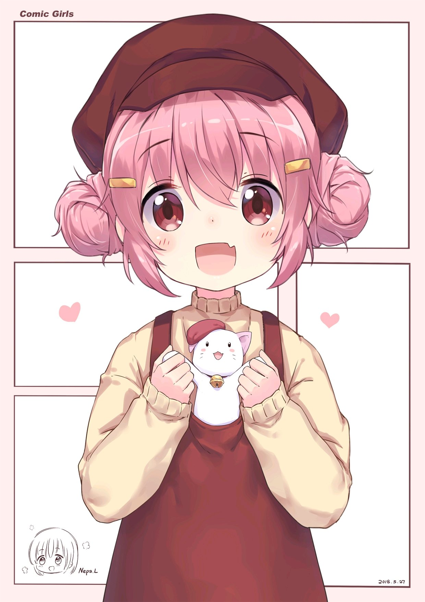

# 04月01日

## 萌田薰子

**祝词**：
```
April 1st is the birthday of Kaoruko Moeda, the 15-year-old four-panel manga artist who lives in the Bunhōsha girls' dormitory o(^▽^)o
When nervous or feeling uneasy, Kaosu-chan lets out her verbal tic "ababababa".

#comicgirls 
#萌田薫子生诞祭2026
```
```
4 月 1 日是住在文芳社女子宿舍的 15 岁四格漫画家萌田薰子的生日 o(^▽^)o
紧张或者感到不安时，小混沌会发出「あばばばば」的口癖。

#comicgirls
#萌田薫子生诞祭2026
```
**图片**：
<table>
  <tr>
    <td></td>
    <td></td>
    <td></td>
  </tr>
</table>


## 近江汐莉

**祝词**：
```
April 1st is the birthday of the mermaid Oumi Shiori who wants to eat Yaotose˶╹ꇴ╹˶!  
Happy Birthday Shiori🎂

#watatabe
#近江汐莉生誕祭2026
```
```
4 月 1 日是想要吃掉比名子的人鱼近江汐莉的生日˶╹ꇴ╹˶！
生日快乐 汐莉🎂
​
#watatabe
#近江汐莉生誕祭2026
```

**图片**：
<table>
  <tr>
    <td></td>
    <td></td>
    <td></td>
  </tr>
</table>