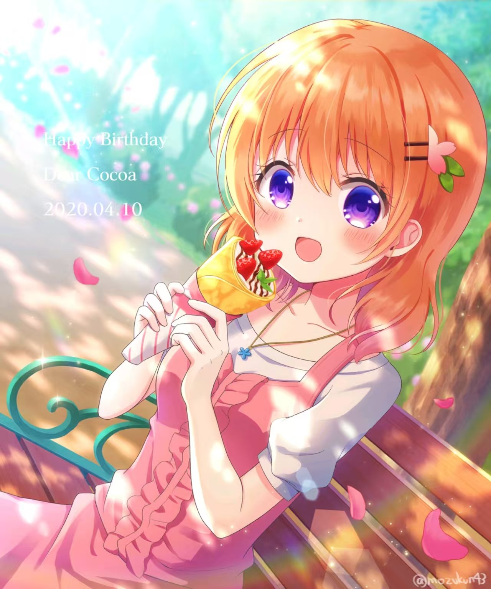
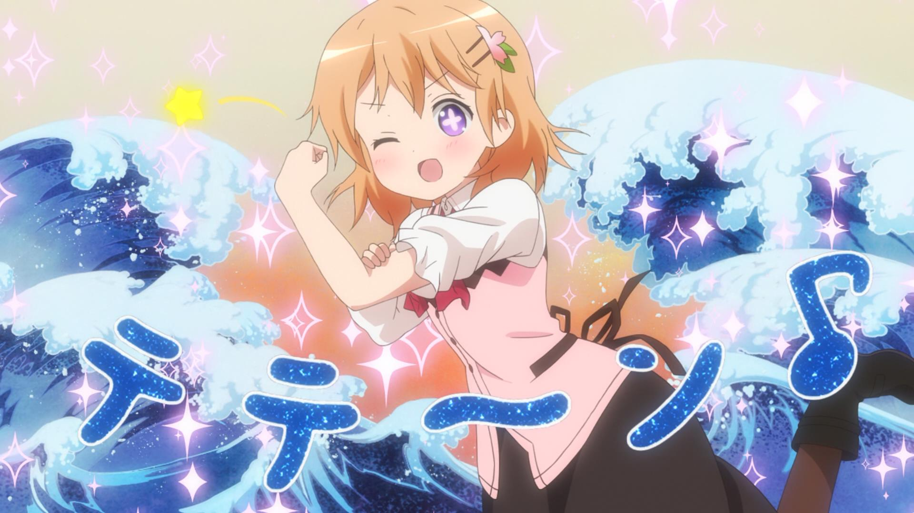
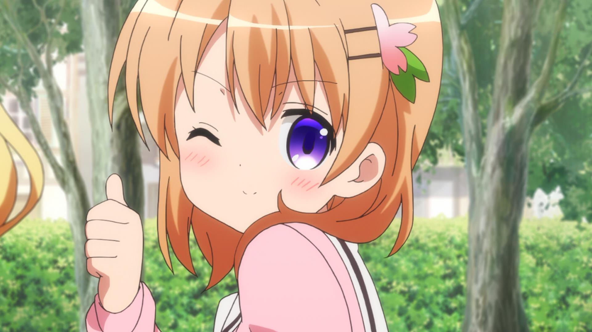
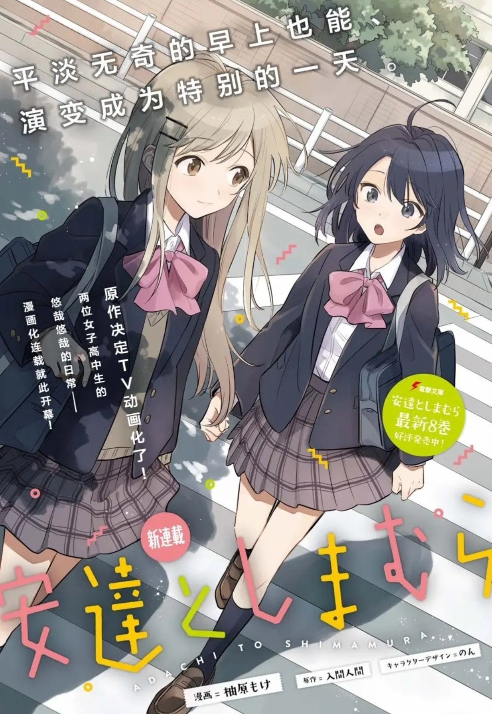
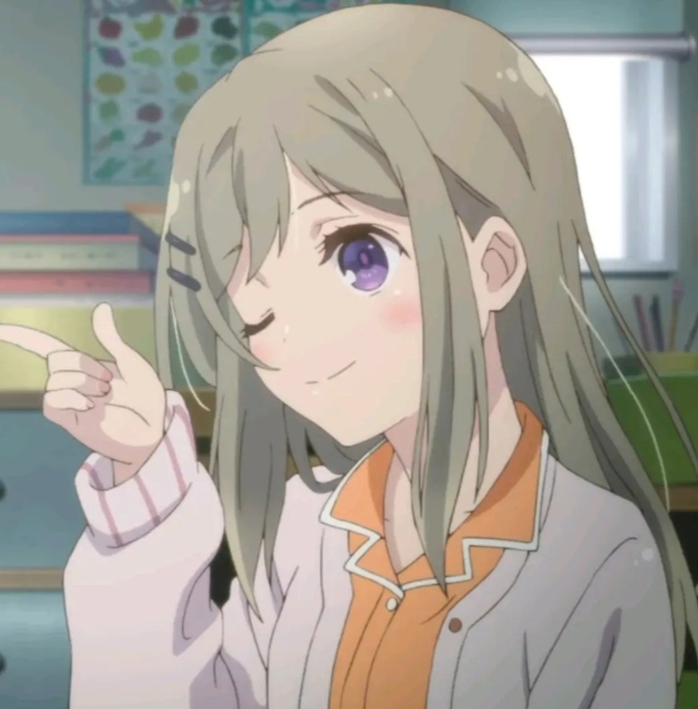
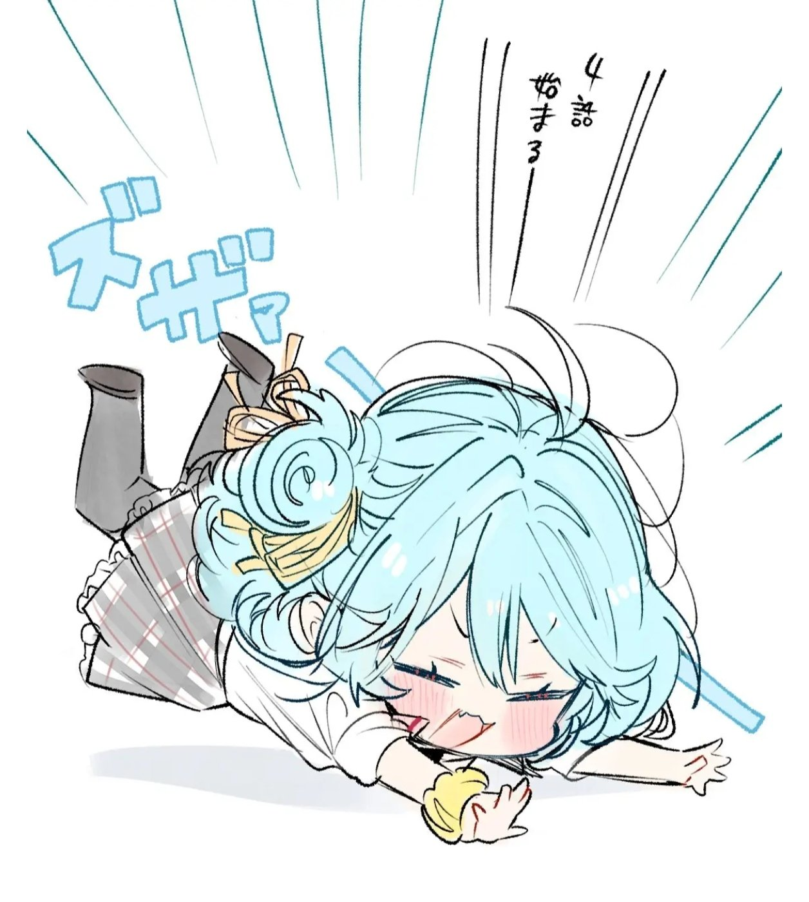
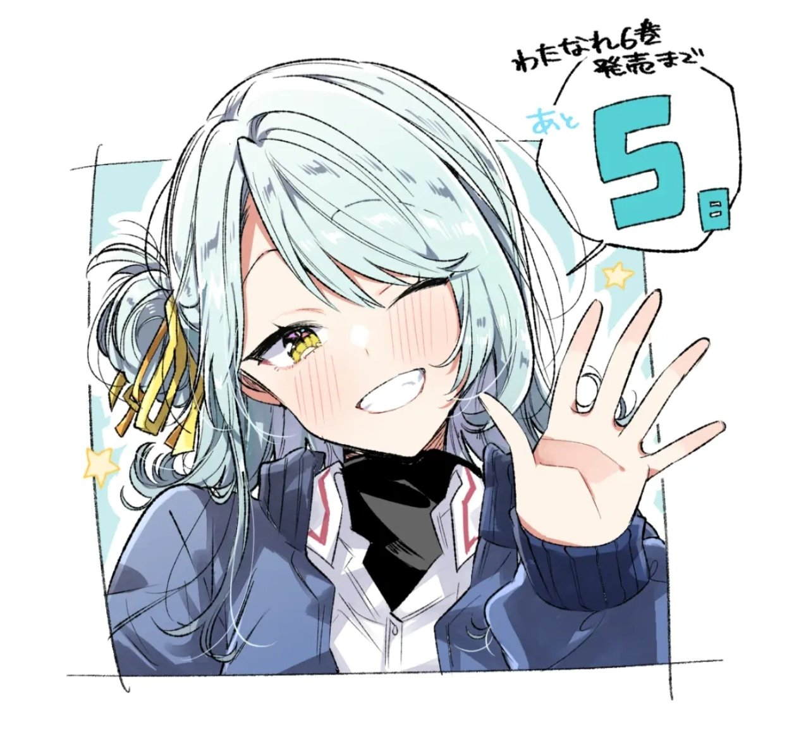

# 4月10日

## 保登心爱

**祝词**：
```
April 10 is the birthday of Cocoa Hoto from "Is the Order a Rabbit?".
"Leave it to your big sister!" — Cocoa.
#gochiusa #ご注文はうさぎですか 
#保登心愛生诞祭2026
```

**图片**：
<table>
  <tr>
    <td></td>
    <td></td>
    <td></td>
  </tr>
</table>


## 岛村抱月

**祝词**：
```
April 10 is the birthday of Shimamura Hougetsu from Adachi and Shimamura.
(1/2)
#安達としまむら 
#島村抱月生诞祭2026
```
```
"I want to fish for a wonderful future. To do that, I have to cast the line first. Although it's not because I was influenced by that fishing-loving future person, I'm trying to cast my rod toward Adachi." — Shimamura
(2/2)
```

**图片**：
<table>
  <tr>
    <td></td>
    <td></td>
    <td></td>
  </tr>
</table>


## 小柳香穗

```
April 10th is the birthday of Koyanagi Kaho from "We Can't Become Lovers! Absolutely Impossible! (※Or So It Seems Possible?)."

#わたなれアニメ 
#小柳香穗生诞祭2026
```
**图片**：
<table>
  <tr>
    <td></td>
    <td></td>
    <td></td>
  </tr>
</table>