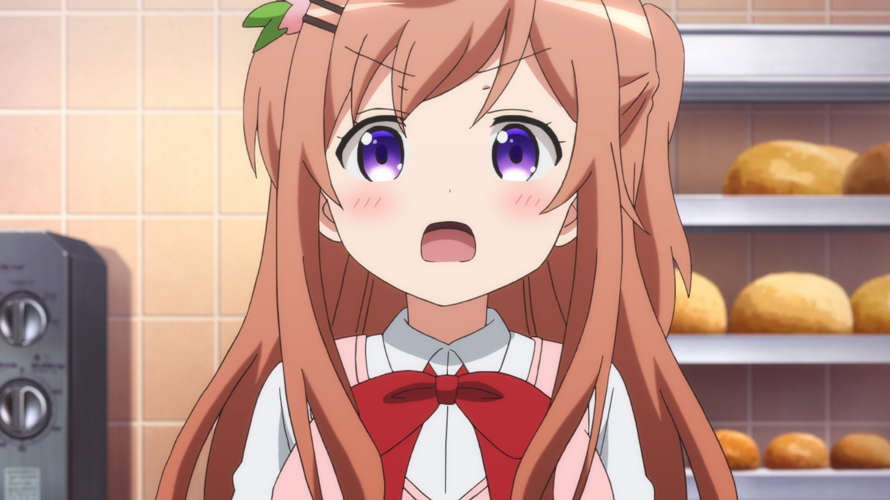

# 03月13日

## 来谷唯湖

**其他名字**： Kurugaya Yuiko | 来ヶ谷（くるがや） 唯湖（ゆいこ）

**来自<番剧/游戏>**：Little Busters!

**<番剧/游戏>的别称**：小小克星 | 校園剋星（台译） | リトルバスターズ！

**萌属性**： 黑长直、 紫瞳、 御姐、 抖S

**祝词**：
```
Today is Yuiko Kurugaya's birthday from Little Busters!, the big-sister figure 🎂🎂🎂.
The scene in the anime where Kurugaya and Riki get trapped in that loop left a really strong impression on me.

#来ヶ谷唯湖誕生祭2026 
#littlebusters
```
```
今天是 little busters 里的大姐姐來谷唯湖的生日，🎂🎂🎂。
在动画中，来谷和理树陷入循环的那个场景令我印象深刻。


#来ヶ谷唯湖誕生祭2026 
#littlebusters
```
**图片**：
<table>
  <tr>
    <td></td>
  </tr>
</table>


## 保登摩卡

**其他名字**： Hoto Moka | 保登（ほと） モカ

**来自<番剧>**：今天也要来点兔子吗？

**<番剧>的别称**：点兔 | Is the Order a Rabbit? | ご注文はうさぎですか？

**萌属性**： 姐姐、 妹控

**祝词**：
```
今天是《今天也要来点兔子吗？》里心爱的姐姐保登摩卡的生日！
摩卡标志性的动作“就交给姐姐吧！”是整个番剧最有趣的部分之一。


#保登モカ生誕祭2026 
#ご注文はうさぎですか
```
```
Today is Mocha Hoto's birthday from *Is the Order a Rabbit?*, the big-sister figure of Cocoa! 🎂🎂🎂

Mocha's signature line "Leave it to your big sis!" is one of the most fun and memorable parts of the entire series.

#保登モカ生誕祭2026 
#gochiusa 
#ご注文はうさぎですか
```
**图片**：
<table>
  <tr>
    <td></td>
    <td></td>
    <td></td>
    <td></td>
  </tr>
</table>
